<div align="center">

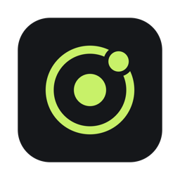

# Orbit

**Vibe coding without the chaos.**<br>
Your projects, your AI agents and your week — in one orbit.


[**Download for macOS**](https://github.com/Tolib-N8/Project-control-center/releases/latest) · [Changelog](CHANGELOG.md) · [Roadmap](#roadmap)

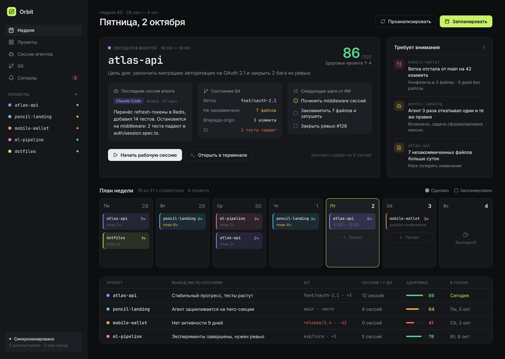

<sub><i>by a vibe coder, for vibe coders</i></sub>

</div>

> [!NOTE]
> **Orbit speaks English and Russian.** It follows your macOS language and can be switched any time in **Settings → General → Language** or on the welcome screen — live, no restart. AI conclusions are written in the language you pick. Screenshots below are from the Russian interface.

---

## Why Orbit

When you run several projects at once and AI agents write most of the code, it's easy to lose the thread: where did the agent get stuck yesterday, which branch has drifted behind `main`, what has been sitting uncommitted for three days, and which project deserves your Friday?

Orbit answers that on its own. It reads your **git repositories** and the **session logs of your coding agents** (Claude Code, Codex, Aider), scores every project's health, flags problems before they hurt, and plans your week around them.

And it closes the loop: keep a task list per project, let AI break a goal into steps, and hand any task to Claude Code or Codex with one click — Orbit follows the agent's session and tells you when the work is ready for review.

## Features

<table>
<tr>
<td width="50%" valign="top">

### 📅 Week
Today's focus project with a goal for the day, the last agent session, git state and next steps. A week plan with actual hours worked — drag a project from the sidebar onto any day.

</td>
<td width="50%" valign="top">

### 🗓 Planner
A projects × days grid. The auto-plan weighs project health, open signals, your rhythm (hours per day, projects per day) and pinned work days. Don't like it? Ask for another variant.

</td>
</tr>
<tr>
<td valign="top">

### 🤖 Agent sessions
Claude Code, Codex and Aider: what got done, where the agent got stuck, tokens, tests, a timeline and the transcript. **Continue with context** (*Продолжить с контекстом*) reopens the same session in your terminal.

</td>
<td valign="top">

### 🌿 Git
Branches, ahead/behind, drift from `main` and conflicts, an "agents vs. you" commit chart, stale branches. Commit with a ready-made message without leaving the app. With the GitHub CLI signed in, open pull requests show up with the one status that matters — *ready to merge*, *needs your review*, *CI failing* — and every repo gets its GitHub Actions state.

</td>
</tr>
<tr>
<td valign="top">

### 🔔 Signals
Uncommitted for over a day, branch behind `main`, an agent reverting its own edits, failing tests, an idle project. Every rule is a toggle, and a signal resolves itself once the problem is gone.

</td>
<td valign="top">

### 🌅 Always on
Checks every 15 minutes, a morning brief at 9:00, an automatic plan on Sunday evening, macOS notifications. Orbit lives in the menu bar when its window is closed.

</td>
</tr>
<tr>
<td valign="top">

### ✅ Tasks
A to-do list on every project page: type a task and press Enter. Right-click to mark it urgent, set a due day or pick the folder it's about — Orbit fills the folder in itself when the title names one. The robot button hands a task to Claude Code or Codex in your terminal, and the task shows where the agent is: *starting*, *working*, *to review*. Or describe a goal and let AI break it into steps you review before adding.

</td>
<td valign="top">

### 🌐 English and Russian
Follows your macOS language, switches live in Settings. AI conclusions come in the language you pick.

</td>
</tr>
</table>

## 🧠 AI analysis

Orbit writes project summaries, next steps, a goal for the day, session breakdowns ("done / stuck / what to do next"), commit messages and briefs for agents that keep going in circles. It also **breaks a goal into tasks**: describe what you want on the project page (✨ in the *Tasks* panel), and the model suggests 3–8 ordered steps with the right folders — you untick or edit them before they're added. Pick the model in **Settings → Analysis** (*Настройки → Анализ*, <kbd>⌘</kbd> <kbd>,</kbd>) or during onboarding:

| Provider | How it works | What you need |
| --- | --- | --- |
| **Claude · subscription** | runs `claude -p` in the background with your Claude Code account | Claude Code signed in to Pro / Max — no API key |
| **Claude API** | Messages API with structured outputs | an Anthropic API key |
| **Codex · subscription** | runs `codex exec` | Codex CLI signed in to ChatGPT |
| **Ollama** | a local model, fully offline | `ollama serve` |
| **OpenAI-compatible** | `/chat/completions` | base URL and key (OpenAI, OpenRouter, LM Studio…) |
| **Heuristics** | rules, no model at all | nothing — the default |

**Privacy.** Only *summaries* are sent to the model: file and branch names, session titles and outcomes, commit messages, test errors — plus the goal you type when breaking it into tasks. Your source code never leaves the Mac — except the diff for commit messages, and only if you turn that on. API keys live in the macOS Keychain. Answers are cached, and a project is re-analysed only when something actually changed and at most every 6 hours, so your subscription limits are safe.

## Screenshots

| | |
| :---: | :---: |
| 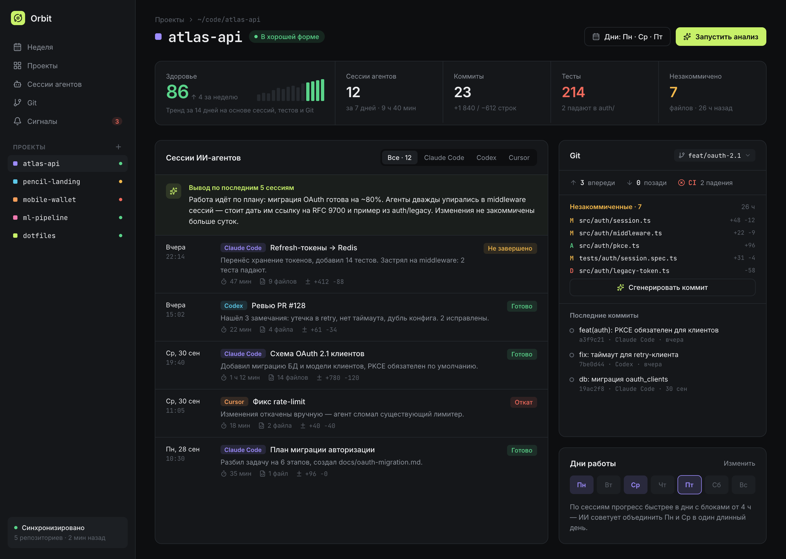 | 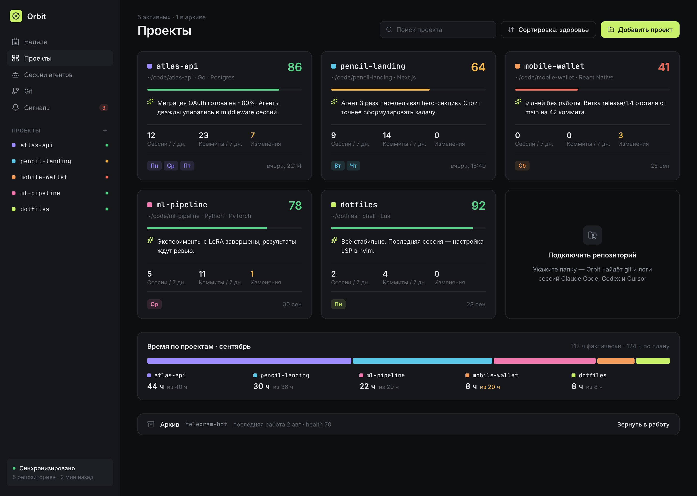 |
| **Project** — health trend, sessions, tasks, git, work days | **Projects** — cards and time per project |
| 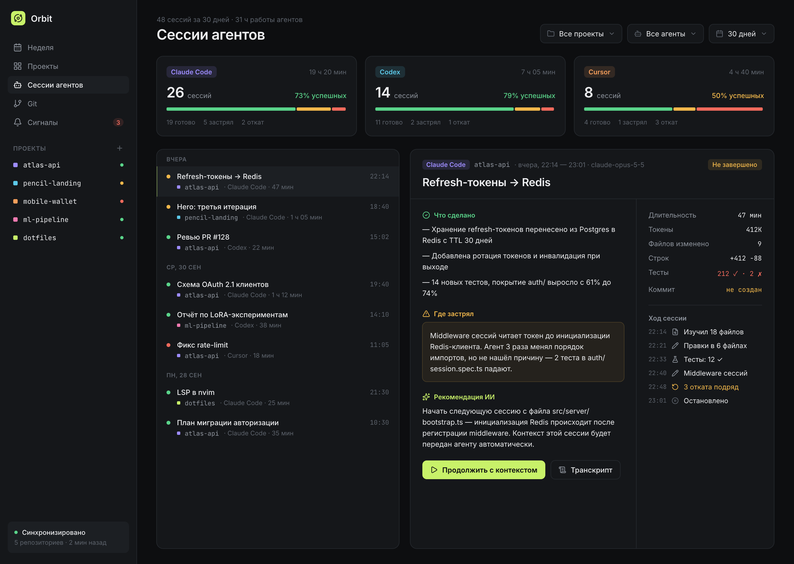 | 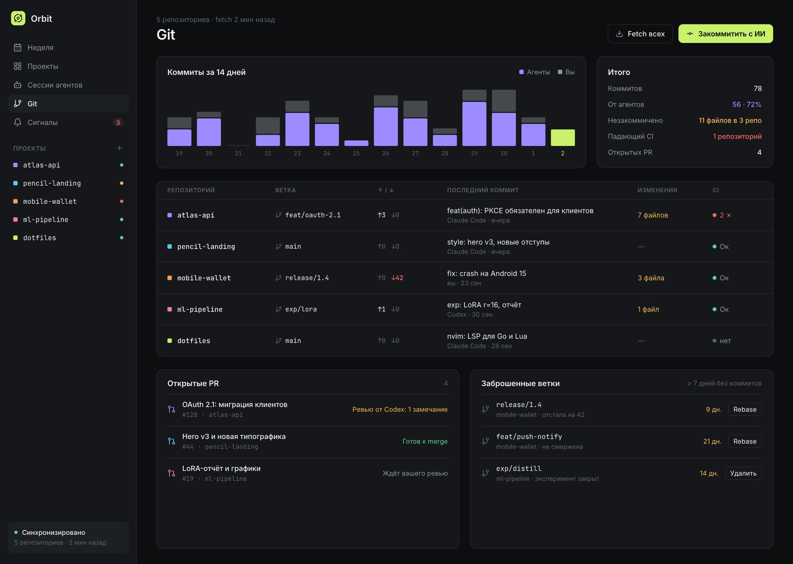 |
| **Agent sessions** — outcome, blockers, recommendation | **Git** — commits, repositories, branches |
| 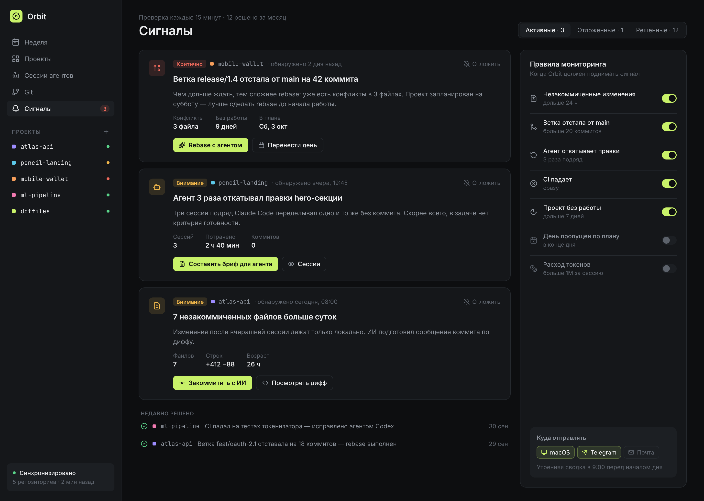 | 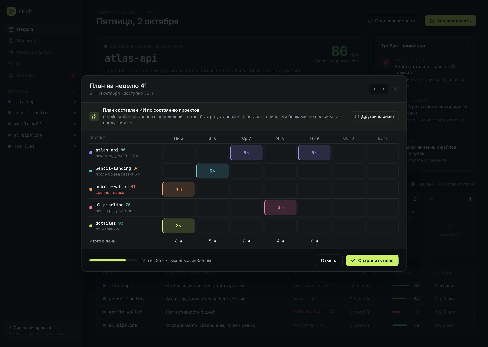 |
| **Signals** — monitoring rules | **Planner** — the week ahead |

<details>
<summary><b>Onboarding and first launch</b></summary>
<br>

| | |
| :---: | :---: |
| 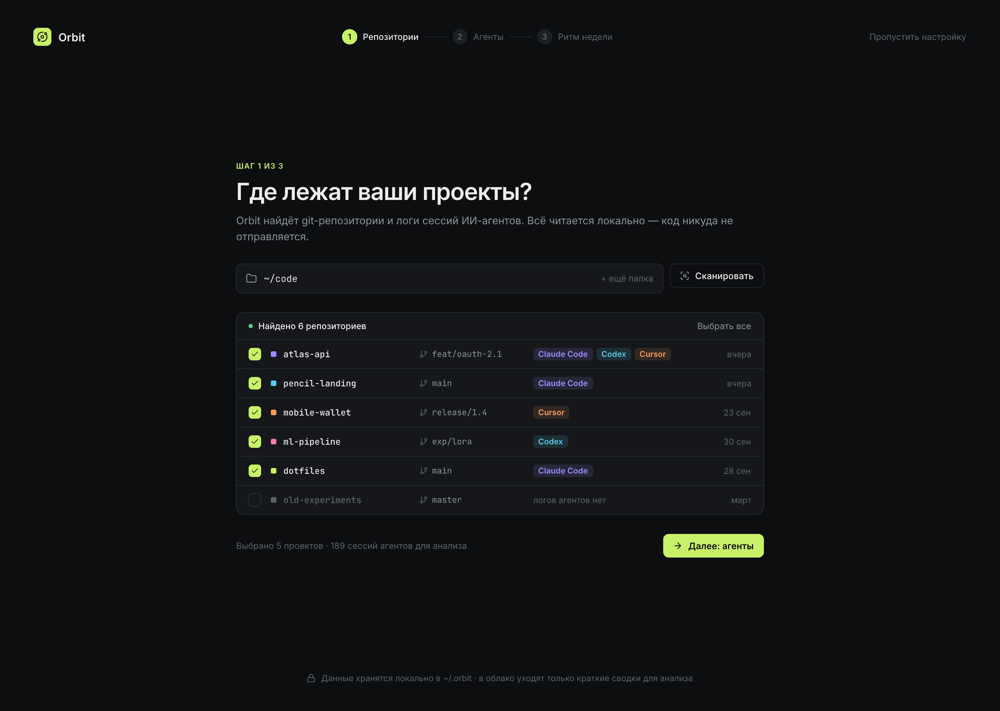 | 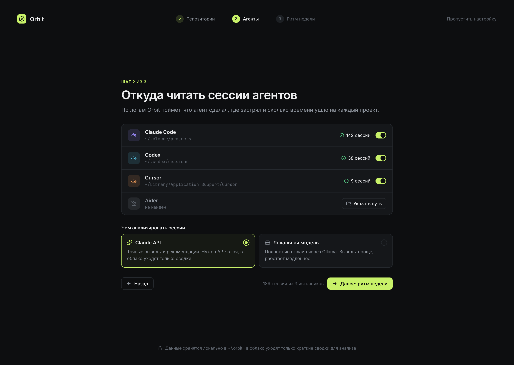 |
| 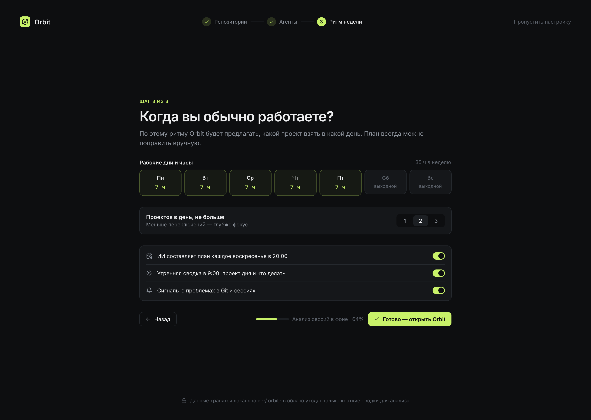 | 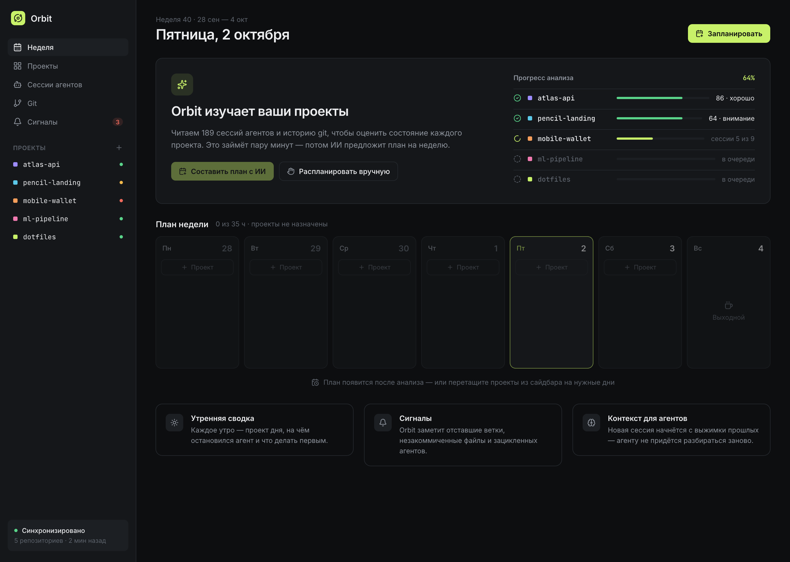 |

</details>

<sub>Screenshots are the design mockups from <code>design/</code> (Pencil). The app is built from them and shows your real projects.</sub>

## Install

1. Download **`Orbit-X.Y.Z.dmg`** from the [latest release](https://github.com/Tolib-N8/Project-control-center/releases/latest).
2. Open it and drag **Orbit** into **Applications**.
3. Launch it and follow the three-step setup: where your projects live, which agents to read, your weekly rhythm.

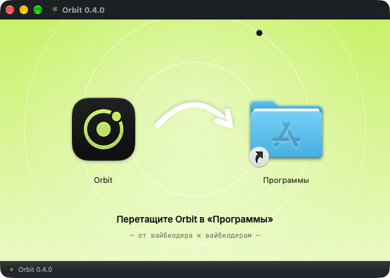

> [!IMPORTANT]
> Orbit isn't notarized by Apple yet, so the first launch needs a right-click → **Open**, or:
> ```sh
> xattr -dr com.apple.quarantine /Applications/Orbit.app
> ```

**Updates are automatic.** Orbit checks GitHub at launch and every 6 hours, shows what's new and, with one click, downloads the update, verifies its SHA-256 checksum, version and code signature, replaces itself and relaunches. You can also use **Orbit → Check for Updates…** (*Проверить обновления…*). Your data in `~/.orbit` is never touched.

## How it works

Everything is read **locally**; app state lives in `~/.orbit`.

| Data | Source |
| --- | --- |
| Branch, ahead/behind, uncommitted files, drift from `main`, conflicts | `git status --porcelain=v2`, `git rev-list`, `git merge-tree` |
| Commits and who made them (an agent or you) | `git log` + `Co-Authored-By` trailers + agent session windows |
| **Claude Code** sessions | `~/.claude/projects/<folder>/*.jsonl` |
| **Codex** sessions | `~/.codex/sessions/**/rollout-*.jsonl` + `session_index.jsonl` |
| **Aider** sessions | `.aider.chat.history.md` in the repository root |
| Health, plan, signals | local heuristics — `Orbit/Services` |
| Tasks | your own list, stored in `~/.orbit/tasks.json` |
| Pull requests and CI | `gh pr list` and `gh run list` with your GitHub CLI account (optional) |
| Summaries, next steps, session breakdowns | the model you chose — `Orbit/Services/AI` — or heuristics |

Logs are parsed once and cached by file size and modification time, so a refresh takes about a second.

<details>
<summary><b>How project health is scored</b></summary>
<br>

A 0–100 score. Penalties: changes uncommitted for more than a day, a branch behind `main`, conflicts, red tests in the last session, more than a week without work, a high share of unfinished or rolled-back sessions. Bonuses: finished sessions and commits this week. ≥ 75 is "in good shape", 50–74 "needs attention", < 50 "critical". See [`HealthEngine.swift`](Orbit/Services/HealthEngine.swift).

</details>

## Keyboard shortcuts

| | |
| --- | --- |
| <kbd>⌘</kbd> <kbd>1</kbd> … <kbd>5</kbd> | Week · Projects · Sessions · Git · Signals |
| <kbd>⌘</kbd> <kbd>R</kbd> | Refresh data |
| <kbd>⇧</kbd> <kbd>⌘</kbd> <kbd>P</kbd> | Plan the week |
| <kbd>⌘</kbd> <kbd>,</kbd> | Settings (AI provider, language, updates) |
| <kbd>↵</kbd> | Add a task (in the *Tasks* field) |
| <kbd>⌘</kbd> <kbd>↵</kbd> | Break the goal into tasks (in the goal window) |

## Build from source

You need **Xcode 26+** and [XcodeGen](https://github.com/yonaskolb/XcodeGen).

```sh
brew install xcodegen
xcodegen generate
xcodebuild -project Orbit.xcodeproj -scheme Orbit -configuration Release \
  -derivedDataPath ~/Library/Developer/Xcode/DerivedData/Orbit build
open ~/Library/Developer/Xcode/DerivedData/Orbit/Build/Products/Release/Orbit.app
```

> [!TIP]
> Keep DerivedData outside `~/Documents`: iCloud adds metadata to synced files and code signing fails with *"resource fork, Finder information, or similar detritus not allowed"*.

<details>
<summary><b>Project structure</b></summary>
<br>

```
Orbit/
├── App/         entry point, AppState, menu bar, launch animation
├── Design/      theme tokens, motion, logo, shared components
├── Models/      projects, git, sessions, plans, signals
├── Services/    git, session parsers, health/insight/signal engines, planner, updater
│   └── AI/      model providers and analysis prompts
└── Features/    Week · Projects · Agent sessions · Git · Signals · Onboarding · Settings
OrbitTests/      parsers on fixtures, git on a temp repo, planner, signals, updater
scripts/         release.sh, make-dmg.sh and the installer design (dmg/)
design/          Pencil mockups and exports
```

</details>

<details>
<summary><b>Development</b></summary>
<br>

```sh
# tests
xcodebuild test -project Orbit.xcodeproj -scheme Orbit \
  -derivedDataPath ~/Library/Developer/Xcode/DerivedData/Orbit -destination 'platform=macOS'

# also run against your real repositories
ORBIT_SMOKE=1 xcodebuild test …
```

Debug builds can save screenshots without screen-recording permission; `--data-dir` replaces `~/.orbit`, so your real data stays untouched:

```sh
Orbit.app/Contents/MacOS/Orbit --data-dir /tmp/orbit-data --snapshot /tmp/shots --auto-onboard
```

`frames:projects` in `--screens` captures frames mid-transition, `--splash-frames` captures the launch animation, `--update-feed <url>` points the updater at a test feed. Put flags without a value (`--reduce-motion`, `--auto-update`) last: macOS reads launch arguments in `-key value` pairs.

</details>

<details>
<summary><b>Releasing</b></summary>
<br>

The version lives in one place — `MARKETING_VERSION` in [`project.yml`](project.yml). Add a `## [X.Y.Z]` section to [CHANGELOG.md](CHANGELOG.md), commit, then:

```sh
scripts/release.sh X.Y.Z            # bump, commit, tag, push, build from the tag, .dmg, GitHub release
scripts/release.sh X.Y.Z --install  # …and install the build into /Applications
```

Each release ships two files: the styled **`.dmg`** for people (built by `scripts/make-dmg.sh` from `scripts/dmg/`) and a **`.zip`** for the in-app updater. Installed copies of Orbit pick the release up at their next update check.

</details>

## Roadmap

- [x] **0.1** — every screen on real data, heuristics instead of AI
- [x] **0.2** — AI analysis: Claude subscription, Claude API, Codex, Ollama, OpenAI-compatible
- [x] **0.3** — animations and transitions, "Reduce motion" support
- [x] **0.4** — launch animation
- [x] **0.5** — self-updates and one-command releases
- [x] **0.6** — welcome screen, drag-to-install `.dmg`
- [x] **0.7** — English interface, live language switching
- [x] **0.8** — tasks on the project page
- [x] **0.9** — hand a task to Claude Code or Codex with one click, break a goal into tasks with AI, a motion for every icon
- [x] **1.0** — GitHub: open pull requests and CI status via `gh`
- [ ] Notifications in Telegram and by email
- [ ] Cursor chat history
- [ ] Apple notarization

---

<div align="center">
<sub>Made by a vibe coder, for vibe coders · <a href="https://github.com/Tolib-N8">@Tolib-N8</a></sub>
</div>
